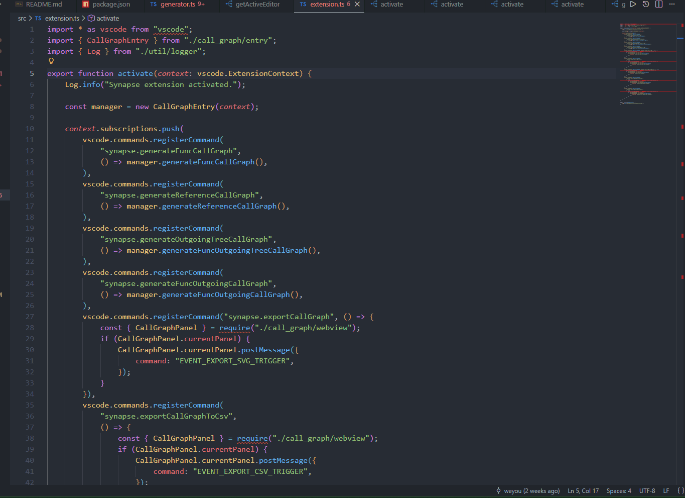
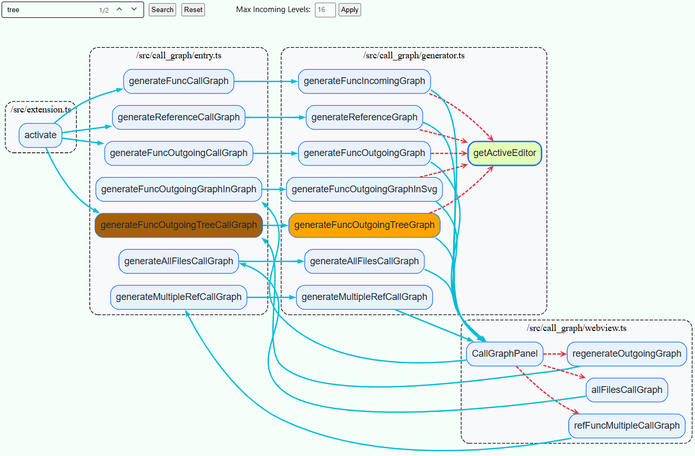

# Synapse
Synapse is a VS Code-based visual code intelligence assistant. It allows for the instantaneous and intuitive viewing of call and reference relationships between functions and symbols. It supports flexible jumping and switching between the GUI and code, as well as the dynamic expansion and collapse of relationship graphs, greatly enhancing software development efficiency.

### Operation Demos

#### 1. Outgoing Call Graph

#### 2. Incoming Call Graph

### Environment Configuration

Synapse utilizes VS Code's built-in call hierarchy API (vscode.prepareCallHierarchy), so it works with mainstream programming languages that provide LSP services (Python, Java, C/C++, Rust, TypeScript/JavaScript, etc.). Please install the appropriate extension and LSP server for your language:

| Language | Extension | LSP server |
|---|---|---|
| C/C++ | [vscode-clangd](https://marketplace.visualstudio.com/items?itemName=llvm-vs-code-extensions.vscode-clangd) / [C/C++](https://marketplace.visualstudio.com/items?itemName=ms-vscode.cpptools) | [clangd](https://clangd.llvm.org/) / Microsoft C/C++ |
| Rust | [rust-analyzer](https://marketplace.visualstudio.com/items?itemName=rust-lang.rust-analyzer) | rust-analyzer |
| Go | [Go](https://marketplace.visualstudio.com/items?itemName=golang.go) | [gopls](https://pkg.go.dev/golang.org/x/tools/gopls) |
| Java | [Language Support for Java](https://marketplace.visualstudio.com/items?itemName=redhat.java) | Eclipse JDT |
| Python | [Pylance](https://marketplace.visualstudio.com/items?itemName=ms-python.vscode-pylance) | Pylance / pylsp |

Please ensure the LSP Server is active before use.

### GUI Features
Place your cursor on a function name, then right-click and choose **Synapse** from the context menu. 

| Command | Description |
|---|---|
| **Generate Incoming Call Graph** | Shows all callers of the selected function, recursively. |
| **Generate Outgoing Call Graph** | Shows all functions called by the selected function. |
| **Generate Outgoing Call Tree** | Same as above, but rendered as a tree layout. |
| **Generate Reference Graph** | Shows all references to the selected symbol. |

Use the mouse wheel to zoom the graph in and out.

### Menu Features

Right-click within the graph to access export functions for node relationships.

| Command | Description |
|---|---|
| **Export Call Graph To SVG** | Saves the current graph as an SVG file. |
| **Export Call Graph To CSV** | Exports the call edges as a CSV file. |
| **Copy Function** | Copies the selected function name to the clipboard. |
| **Copy File Path** | Copies the file path of the selected node. |
| **Jump to Function** | Opens the source file at the selected function's definition. |

### Extension Settings
Supports blacklisting at different levels (function/class/file path) to avoid unnecessary redundancy in the display.

| Setting | Default | Description |
|---|---|---|
| `Synapse.callGraphFunctionBlacklist` | `["operator()"]` | Function names to exclude from all graphs. |
| `Synapse.callGraphClassBlacklist` | `["std"]` | Class/namespace prefixes whose methods are excluded. |
| `Synapse.callGraphPathBlacklist` | `[]` | File path prefixes to exclude (e.g. third-party or build directories). |

### Release History

#### 0.1.0

Initial release.
